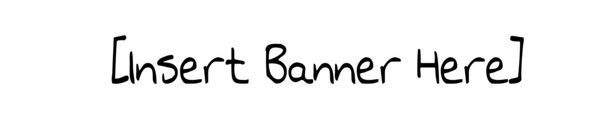

# Naam van het project

## Over het project

Korte beschrijving van het project: wat is het, waarom is het gemaakt, en wat is de algemene doelstelling?

### Sequence of operation

Beschrijf kort wat je verwacht nadat alle hardware en software zijn opgezet volgens de stappen onder **Getting Started**. Deze sectie dient als handleiding voor niet-technische gebruikers.

1. Verbind het bord met de computer via USB.
2. De groene LED schakelt automatisch in om aan te geven dat het systeem actief is.
3. In de seriële terminal verschijnt een welkomstbericht.
4. De lineaire slider voert een automatische kalibratie uit en beweegt zichzelf naar het midden.
5. Wacht tot een piepsignaal klinkt en plaats daarna de telefoon op de houder van de slider.

Volg eventueel verdere aanwijzingen die in de terminal worden weergegeven of op de interface te zien zijn.

## Materialen en methodes

> 💡**Werk op een versiebeheer-vriendelijke manier**
>
> Gebruik **platte tekstformaten** zoals Markdown of CSV-bestanden. Deze zijn leesbaar in GitHub en goed te volgen in versiebeheer.
>
> Vermijd het gebruik van externe links naar afbeeldingen of bestanden (zoals datasheets of documenten). Voeg deze lokaal toe in bijvoorbeeld een `media` of `datasheets` map. Externe links kunnen breken wanneer de originele bron verdwijnt of als deze repository wordt hernoemd, geforkt of offline gehaald.

- **Hardware**: lijst van gebruikte componenten (bv. sensoren, microcontrollers, actuatoren).
- **Software**: overzicht van programmeertalen, libraries en tools.
- **Methodologie**: korte beschrijving van de werkwijze.

## Resultaten

- Korte samenvatting van de belangrijkste bevindingen.
- Eventuele grafieken, tabellen of afbeeldingen.
- Reflectie op prestaties of betrouwbaarheid.

## Aan de slag

Niets zo frustrerend als goede code vinden zonder uitleg over hoe je het aan de praat krijgt.

- [ ] Voeg hier een stapsgewijze handleiding toe.
- [ ] Leg uit hoe je het programma start.

## Toekomstig werk en problemen

- Mogelijke uitbreidingen of verbeteringen.
- Bekende bugs of beperkingen.
- Link eventueel naar een issue bv. #1

## Personen

- **Contri Butor1** – _Student_ – [GitHub](https://github.com/CONTRIBUTOR1)
- **Dieter Vanrykel** – _Docent_ – [GitHub](https://github.com/Vanrykel)
