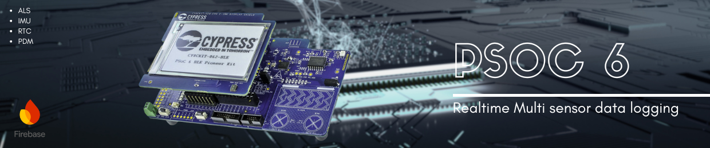

<p align="center">
  <a href="https://github.com/MauroDeBruyn/realtimeMultiSensorLogger">
    
  </a>
  
  <a href="https://github.com/MauroDeBruyn/">
    
  </a>

  <a href="https://github.com/MauroDeBruyn/">
    
  </a>
</p>

# Real-Time multi data sensor logger



## About the Project

This project will log sensor data using the **PSoC 6 Pioneer Kit (CY8CKIT-062-WiFi-BT)**.  
The system collects data from **analog, digital, and I²C sensors**, timestamps it (**RTC**), and uploads it to **Firebase Realtime Database** for monitoring.  
The system uses internal sensors (Ambient Light Sensor, Motion Sensor, PDM Microphone) and external sensors.

### Sequence of Operation

1. **Sensor capture**
    - Ambient Light Sensor (ALS) via ADC
    - Motion sensor (IMU) via I²C
    - PMD Microphone
    - External sensor

2. **Timestamping**
    - Data is timestamped using the **Real-Time Clock(RTC)**.

3. **Data logging**
    - Data is send using the JSON format {timestamp: "2024-05-20T14:30:00", light: 320, motion: 1.2, sound: 65}
    - Primary: Periodic upload (every 10 seconds) to **Firebase Realtime Database** in JSON format.
    - Backup: Store data in on-chip **flash memory** in case of a network failure.

4. **User Interface**
    - **TFT Display**: Shows live sensor data values.
    - **Status LED**:
        - Green: Network connected / Firebase connected
        - Red: Network Error / Firebase Error (Local flash memory active)


## Materials and Methods


#### Hardware
- **PSoC 6 Pioneer Kit**: (CY8CKIT-062-WiFi-BT)
- Onboard sensors:
  - Ambient Light Sensor
  - IMU (motion detection via I²C)
  - PDM Microphone
- TFT Display
- Status LEDs
- External sensors (optional: analog, digital, I²C)

#### Software
- **ModusToolbox** for firmware development
- **Firebase** for Realtime Database
- Wi-Fi HTTP requests for data transfer
- Error handling and flash fallback
- RTC for timestamping


## Results
- Successfully acquired data from ALS, IMU, and PDM microphone.
- Real-time data uploaded to Firebase in structured JSON format:
  ```json
  {
    "timestamp": "2025-07-20T14:30:00",
    "light": 320,
    "motion": 1.2,
    "sound": 65
  }

- TFT display shows live measurements.
- LED indicators provide real-time status feedback.
- Local flash storage ensures no data loss during network failures.


## Getting Started

### Prerequisites

- PSoC 6 Pioneer Kit (CY8CKIT-062-WiFi-BT)
- ModusToolbox IDE
- Firebase project with Realtime Database enabled
- Wi-Fi credentials for device connectivity

### Installation
1. Clone this repository:
    ```bash
    git clone https://github.com/MauroDeBruyn/realtimeMultiSensorLogger
2. Open the project in ModusToolbox IDE.
3. Configure Firebase connection (database URL).
4. Build and flash the firmware to the PSoC 6 board.
5. Connect the board to Wi-Fi and monitor real-time data on Firebase.


## Issues
- Add support for more external sensors.


## People
- **Contributor** – Mauro De Bruyn – [GitHub](https://github.com/maurodebruyn)
